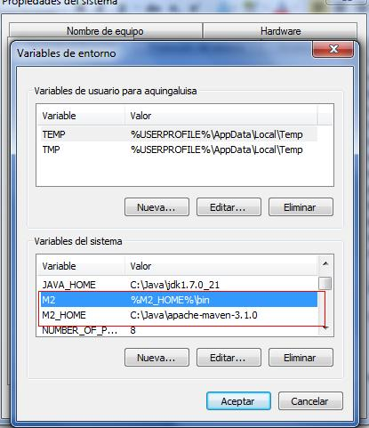
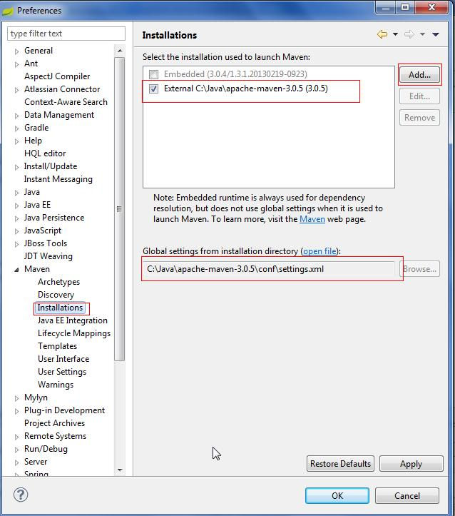
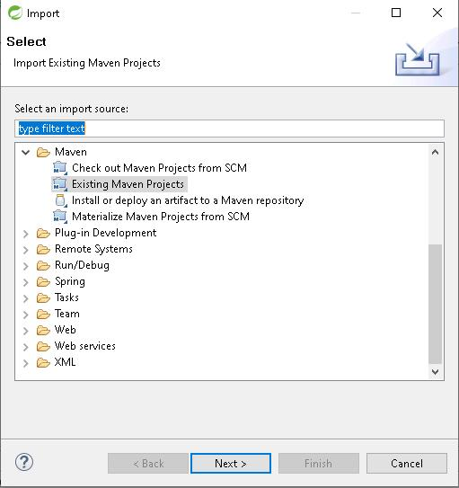
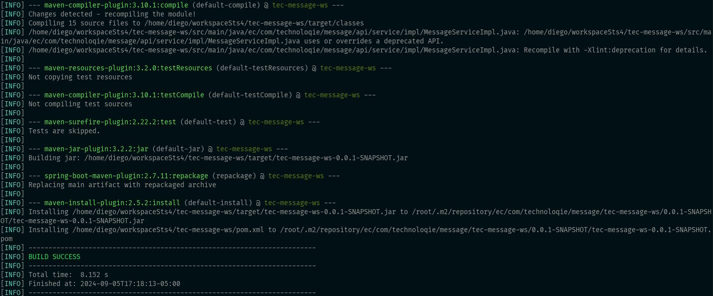
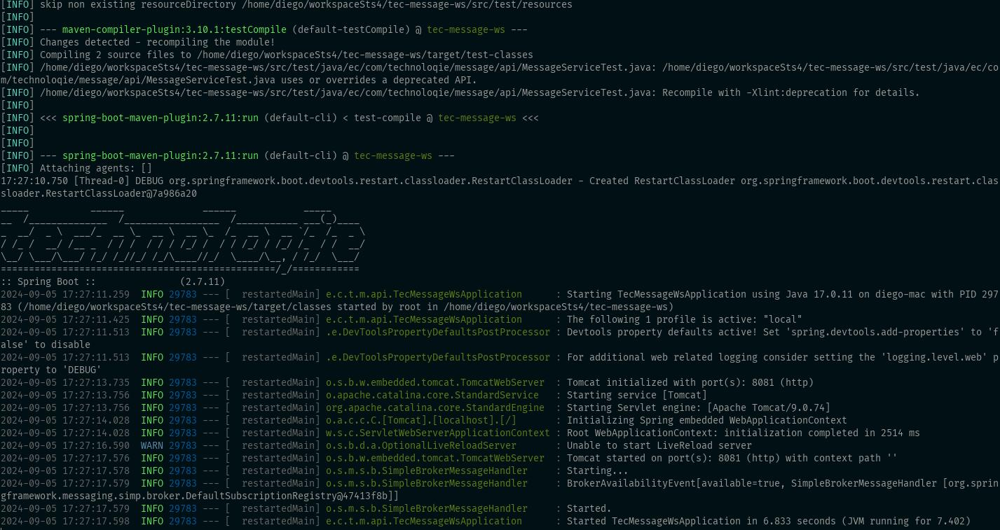
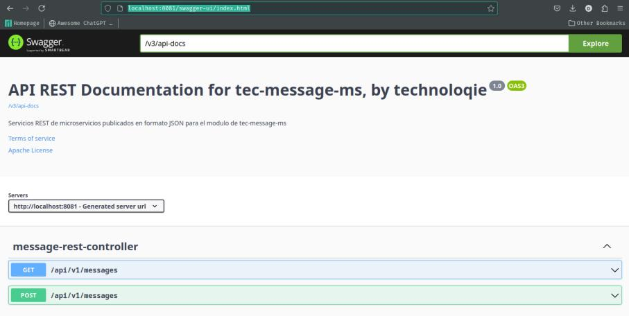

# Guía de Primera Ejecución del Sistema Smart de Chatbot

Esta guía detalla los pasos necesarios para la instalación, configuración y primera ejecución de los componentes del Sistema Smart de Chatbot. Incluye requisitos de hardware y software, así como procedimientos para la ambientación del entorno de desarrollo y despliegue.

## 1. Requisitos del Sistema

### 1.1 Hardware Recomendado
Para un óptimo rendimiento y funcionalidad del sistema, se recomienda el siguiente hardware, probado en entornos Windows 10 y Linux:

*   **Memoria RAM**: 8 GB
*   **Espacio en Disco Duro**: 12 GB
*   **Procesador**: Intel Core i7 o equivalente

### 1.2 Software Requerido
El entorno de desarrollo y despliegue del chatbot requiere el siguiente software:

*   **Sistema Operativo**: Windows 10 o superior, o Linux Ubuntu
*   **Base de Datos**: MySQL 8.0, MongoDB Atlas
*   **Herramientas de Desarrollo**:
    *   Spring Tool Suite 4 (Eclipse)
    *   MySQL Workbench
    *   Apache Maven 6.6.3
    *   Java 11 o superior
*   **Contenedorización**: Docker
*   **Servidor de Lenguaje Extendido**: Ollama
*   **Monitoreo de GPU (Opcional)**: nvtop
*   **Servidor Web (para Frontend)**: Apache HTTP Server
*   **Cliente SSH**: Para acceso remoto a servidores.
*   **Control de Versiones**: Git
*   **Plataformas de Mensajería**: Telegram (para bot)
*   **Gestor de Contenido (Opcional)**: WordPress (para integración con plugin)

## 2. Ambientación del Entorno de Desarrollo

### 2.1 Configuraciones del Ambiente (Desarrollo Java)
Para la creación, desarrollo y ejecución de proyectos Java, es necesario instalar las siguientes herramientas:

#### Spring Tool Suite 4 (Eclipse)
Entorno de desarrollo integrado (IDE) completo para la creación de microservicios Spring Boot.
**Enlace de Descarga**: [https://spring.io/tools](https://spring.io/tools)
Descargue la versión 4.

#### Quitar Validadores Eclipse
Para optimizar el rendimiento del IDE, se recomienda deshabilitar validadores innecesarios en Eclipse. Acceda a `Window > Preferences > Validation` y deshabilite los validadores no requeridos para su proyecto.

#### Maven Windows Configuración
1.  **Descargar Maven**: Descargue la versión binaria de Apache Maven desde la página oficial: [https://maven.apache.org/download.cgi?.](https://maven.apache.org/download.cgi?.)
2.  **Descomprimir**: Extraiga el archivo ZIP en una ubicación de su preferencia, por ejemplo, `C:\Java\apache-maven-3.6.3`.
3.  **Variables de Entorno**: Configure las siguientes variables de entorno del sistema:
    *   `M2_HOME`: `C:\Java\apache-maven-3.6.3` (Ruta donde descomprimió Maven)
    *   `M2`: `%M2_HOME%\bin`
    *   `JAVA_HOME`: `C:\Java\jdk17.0.11` (Ruta de su instalación de Java Development Kit)
    *   `Path`: Agregue `%JAVA_HOME%\bin;%M2%;` al inicio de la variable `Path` existente.



#### Maven Dependencias
Configure el repositorio local de Maven donde se descargarán las librerías. Esto se realiza editando el archivo `settings.xml` de Maven (usualmente en `%M2_HOME%/conf/settings.xml`) para apuntar a un repositorio local o remoto si fuera necesario.



### 2.2 Cargar Proyectos desde GitHub
Para obtener el código fuente de los microservicios, clone los siguientes repositorios de GitHub. Acceda a la consola o terminal y ejecute el comando `git clone` para cada proyecto:

*   **Módulo de Seguridad**: `https://github.com/dijavaji/tec-framework-security.git`
*   **API del Chatbot**: `https://github.com/dijavaji/tec-chatbot-ws.git`
*   **API de Mensajes**: `https://github.com/dijavaji/tec-wa-message-ws.git`
*   **Aplicación de Chat (Frontend)**: `https://github.com/dijavaji/tec-chat-app.git`
*   **API de Exploración de Datos**: `https://github.com/dijavaji/tec-document-loader-ws.git`

Posteriormente, importe cada proyecto al IDE STS para su utilización. Utilice la opción de importar proyectos Maven existentes.




### 2.3 Compilar y Ejecutar Proyectos (Entorno Local)

Acceda a la ruta de cada proyecto en la consola y ejecute los siguientes comandos Maven:

1.  **Compilar y Generar el Proyecto (saltando tests)**:
    ```bash
    mvn clean install -Dmaven.test.skip=true
    ```


2.  **Ejecutar la Aplicación en Local con Perfil `local`**:
    ```bash
    mvn spring-boot:run -Dspring-boot.run.profiles=local
    ```


Si la ejecución se realiza sin errores, podrá acceder a la documentación de la API Rest a través de Swagger UI:

*   **Swagger UI**: [http://localhost:8081/swagger-ui/index.html](http://localhost:8081/swagger-ui/index.html)


