# Guía de Instalación del Sistema Smart de Chatbot

Esta guía detalla los pasos necesarios para la instalación, configuración y ejecución de los componentes del Sistema Smart de Chatbot.

## 1. Configuración y Despliegue en Servidor

### 1.1 Configuración del Servidor de Pruebas CHATBOT

El servidor de pruebas se encuentra configurado en una instalación funcional Linux, utilizando cualquier proveedor de servicios en la nube.

*   **Consola del servidor**: ``ssh root@192.168.1.100``
*   **Aplicación (Frontend)**: [https://chatbot.technoloqie.cloud/](https://chatbot.technoloqie.cloud/) (IP de ejemplo, verificar la actual)
*   **Instancias VM (Compute Engine)**: `chatbot.technoloqie.website`, `chatbot-api.technoloqie.website`
*   **Credenciales**: Usuario `admin@pbx.com`, Clave (solicitar al administrador)

Se requiere un navegador web y un cliente SSH para acceder a la consola del servidor y a las instancias VM.

*Capturas de pantalla de la consola GCP y las instancias VM* (Referencia: Imágenes en el documento original)

### 1.2 Procedimiento de Instalación del Frontend en Servidor Web Apache

Para desplegar la aplicación frontend (Reactjs) en un servidor web Apache:

1.  **Compilar la Aplicación Reactjs**: Navegue al directorio del proyecto `tec-chat-app` y ejecute:
    ```bash
    npm run build
    ```
    Esto generará los archivos estáticos optimizados en el directorio `build/`.

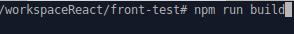

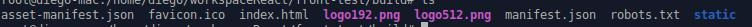

2.  **Copiar Archivos Compilados**: Copie el contenido del directorio `build/` al directorio de despliegue de Apache, por ejemplo, `/var/www/html/tec-app/`:
    ```bash
    sudo cp -r build/* /var/www/html/tec-app/
    ```
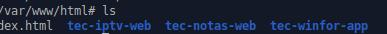

3.  **Configurar Apache**: Edite el archivo de configuración de Apache para el sitio por defecto. Acceda al directorio:
    ```bash
    cd /etc/apache2/sites-available/
    ```
    Visualice el contenido del archivo de configuración:
    ```bash
    cat 000-default.conf
    ```
    Edite el archivo para modificar el `DocumentRoot` y apuntar a su aplicación. Por ejemplo, si su carpeta se llama `tec-app`:
    ```apache
    DocumentRoot /var/www/html/tec-app
    ```
    Guarde los cambios y reinicie Apache.

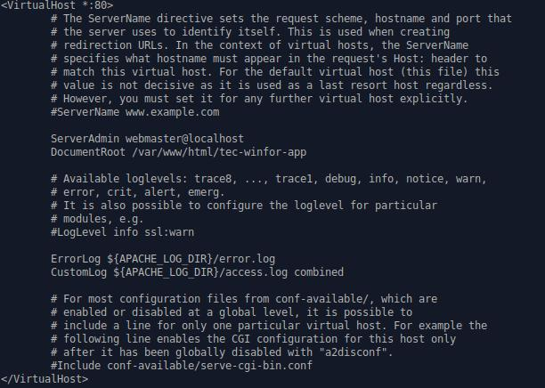

### 1.3 Instalación de Java en el Servidor

Para instalar Java 11 o superior en el servidor, se recomienda utilizar `sdkman` para una gestión más sencilla de versiones. Si no está instalado, primero instale `sdkman`:

1.  **Instalar SDKMAN (si no está instalado)**:
    ```bash
    curl -s "https://get.sdkman.io" | bash
    source "$HOME/.sdkman/bin/sdkman-init.sh"
    ```

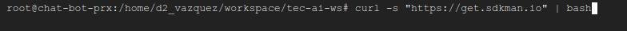

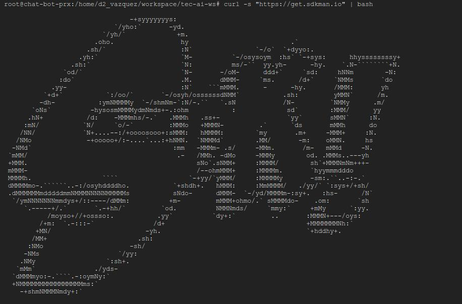

2.  **Instalar Java**: Utilice `sdkman` para instalar Java 11 (o la versión deseada):
    ```bash
    sdk install java 11.0.11-tem
    ```

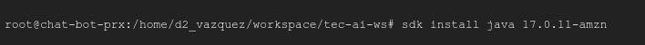

### 1.4 Instalación del Servidor Ollama

Ollama es un servidor de lenguaje extendido esencial para el funcionamiento del chatbot. Para su instalación y configuración, siga la guía oficial para Linux:

**Guía de Instalación**: [https://github.com/ollama/ollama/blob/main/docs/linux.md](https://github.com/ollama/ollama/blob/main/docs/linux.md)

1.  **Instalar Ollama**: Ejecute el comando proporcionado en la guía de instalación (ejemplo para Linux):
    ```bash
    curl -fsSL https://ollama.com/install.sh | sh
    ```
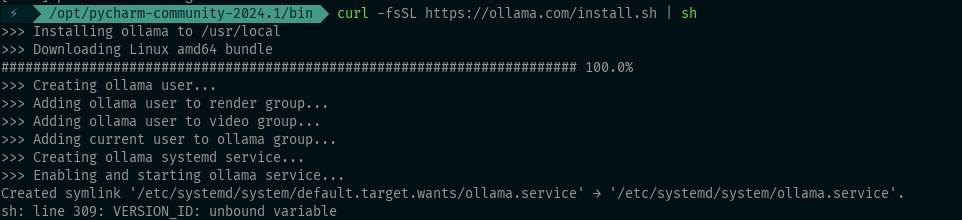

2.  **Descargar Modelos**: Descargue el modelo de lenguaje que utilizará el chatbot (ejemplo: `qwen2:0.5b`):
    ```bash
    ollama run qwen2:0.5b
    ```
    Esto iniciará la descarga del modelo si no está presente.

3.  **Verificar Modelos Instalados**:
    ```bash
    ollama list
    ```

4.  **Iniciar Ollama**: Asegúrese de que el servicio Ollama esté corriendo.

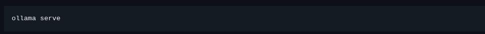


5.  **Probar Ollama**: Realice una prueba de conexión y generación de respuesta:
    ```bash
    curl -X POST http://127.0.0.1:11434/api/generate -d '{ "model": "llama3", "prompt":"Por que el cielo es azul?", "stream": true}'
    ```

### 1.5 Instalación de nvtop (Opcional)

nvtop es un monitor de tareas de Linux que permite visualizar el uso de GPU de NVIDIA, AMD e Intel. Es útil para monitorear el rendimiento de los modelos de IA.

1.  **Actualizar Repositorios e Instalar nvtop**:
    ```bash
    sudo apt update
    sudo apt install nvtop
    ```

2.  **Ejecutar nvtop**: Una vez instalado, inicie la herramienta con:
    ```bash
    nvtop
    ```
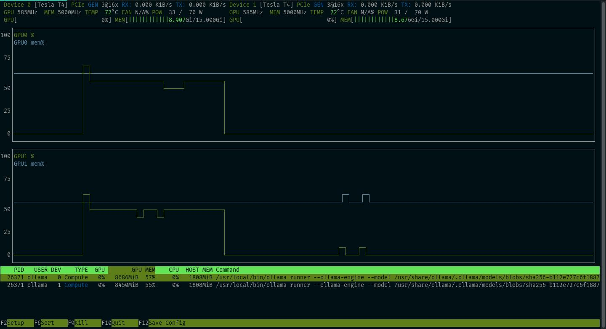

### 1.6 Procedimiento de Actualización de Versiones de Microservicios Docker al Servidor

Para actualizar las versiones de los microservicios docker en el servidor, siga estos pasos:

1.  **Pull de Nuevas Imágenes**: Obtenga las últimas imágenes de Docker para cada microservicio desde su registro de contenedores (ej. Docker Hub o Google Container Registry):
    ```bash
    docker pull technoloqie/tec-fwk-security-api:latest
    docker pull technoloqie/tec-chatbot-api:latest
    # ... para todos los microservicios
    ```
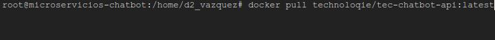

2.  **Detener y Eliminar Contenedores Antiguos**: Detenga y elimine las instancias en ejecución de los microservicios antiguos:
    ```bash
    docker stop tec-fwk-security-api tec-chatbot-api # ...
    docker rm tec-fwk-security-api tec-chatbot-api # ...
    ```

3.  **Lanzar Nuevos Contenedores**: Inicie los nuevos contenedores con las imágenes actualizadas, asegurándose de configurar las variables de entorno y mapeos de puertos correctamente (usando `docker run` o `docker-compose up`).

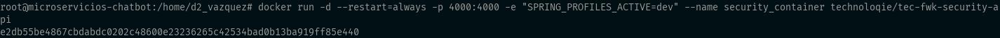

### 1.7 Instalación de MySQL en Contenedor Docker

Para instalar MySQL 8.0 utilizando Docker:

1.  **Pull de la Imagen de MySQL**: Obtenga la imagen oficial de MySQL:
    ```bash
    docker pull mysql:8.0
    ```

2.  **Ejecutar Contenedor MySQL**: Inicie un contenedor MySQL, configurando la contraseña del usuario root y mapeando el puerto:
    ```bash
    docker run --name mysql-chatbot -e MYSQL_ROOT_PASSWORD=your_secure_password -p 3306:3306 -d mysql:8.0
    ```


3.  **Acceder a MySQL (opcional)**:
    ```bash
    mysql -h 127.0.0.1 -u root -p
    ```
    Ingrese la contraseña configurada.


### 1.8 Crear una Base de Datos en MongoDB Atlas

MongoDB Atlas es una base de datos en la nube (DBaaS) que se utilizará para almacenar datos del chatbot. Siga estos pasos para configurar una base de datos gratuita (M0 Sandbox):

1.  **Registrar una cuenta**: Vaya a [MongoDB Atlas](https://www.mongodb.com/cloud/atlas) y regístrese con su dirección de correo electrónico.

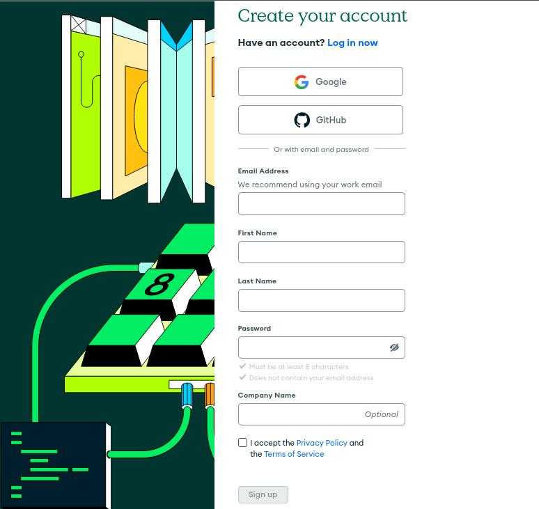

2.  **Crear un Nuevo Cluster**: Después de iniciar sesión:
    *   Llene los campos `Nombre de la organización` y `Nombre del proyecto`.
    *   Seleccione el lenguaje de programación preferido (ej. Java).
    *   Haga clic en `Crear un Cluster` debajo de `Shared Clusters` (la opción `M0 Sandbox` es gratuita).
    *   Deje la opción por defecto en `Cloud Provider & Region` (normalmente AWS).
    *   Deje la opción por defecto en `Cluster Tier` (`M0 Sandbox - 512 MB Storage`).
    *   Asigne un `Nombre del Cluster` o deje el valor por defecto (`Cluster0`).
    *   Haga clic en `Create Cluster`.
    Espere a que el cluster se aprovisione (1-3 minutos).
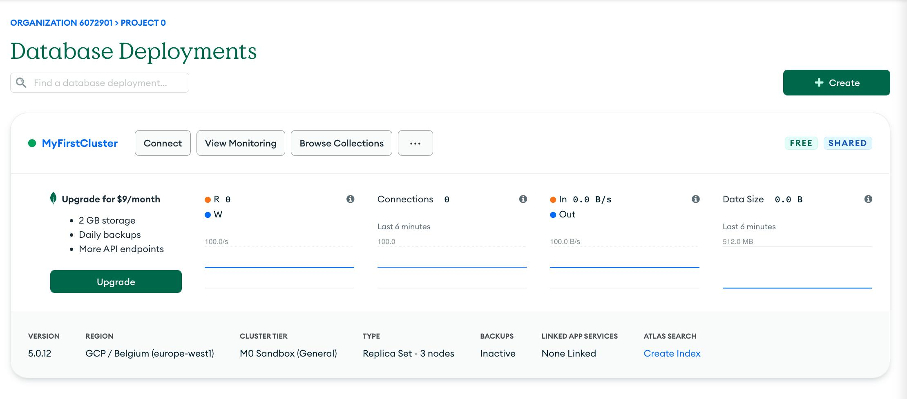

3.  **Crear un Usuario de Base de Datos**:
    *   Especifique un `Nombre de usuario` y una `Contraseña` (o use la sugerida por Atlas).
    *   Haga clic en `Create Database User`.

4.  **Configurar Lista de Acceso IP**:
    *   Agregue su dirección IP actual a la lista de acceso (`Add My Current IP Address`).
    *   Haga clic en `Finish and Close`.
    *   Finalmente, haga clic en `Go to Overview`.

5.  **Crear una base de datos**:
    *   **Navegación**: Desde la página principal de su clúster, acceda a la sección de `Collections` mediante la opción "Explorar colecciones".
    *   **Inicio de Creación**: En ausencia de bases de datos existentes, el sistema le guiará para crear una nueva base de datos y colección a través del botón "Añadir mis propios datos".
    *   **Configuración Inicial**: Especifique el `Nombre de la Base de Datos` y el `Nombre de la Colección` en el modal emergente.
    *   **Confirmación**: Haga clic en el botón "Crear" para instanciar la base de datos y su colección inicial.
    *   **Disponibilidad**: La base de datos estará inmediatamente disponible para la inserción manual de documentos o la conexión a través de controladores de MongoDB para la integración programática.

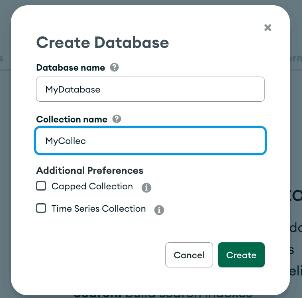

### 1.9 Instalar Bot para Telegram

Para integrar el chatbot con Telegram, deberá crear un bot a través de BotFather y configurar los tokens necesarios.

1.  **Crear un Nuevo Bot con BotFather**: En Telegram, busque `@BotFather` y envíe el comando `/newbot`. Siga las instrucciones para nombrar su bot y obtener el `HTTP API Token`.
    *Captura de pantalla de la interacción con BotFather* (Referencia: Imagen en el documento original)

2.  **Configurar el Microservicio del Bot**: Actualice el microservicio de mensajes (`tec-messages-api`) con el token de su bot de Telegram y otras configuraciones específicas para la integración.

### 1.10 Instalar un Plugin de WordPress

Si desea integrar el chatbot como un widget en un sitio web de WordPress, puede instalar un plugin personalizado desde el panel de control de WordPress.

1.  **Acceder al Panel de Administración de WordPress**: Inicie sesión en su panel de administración de WordPress.
2.  **Ir a Plugins**: Navegue a `Plugins > Añadir nuevo`.
3.  **Subir Plugin**: Haga clic en `Subir Plugin` y seleccione el archivo `.zip` del plugin del chatbot que le fue proporcionado.

4. **Editar el sitio**: modificar y agregar en el código el siguiente tag. ``[tec_chat_widget]``

4.  **Instalar y Activar**: Haga clic en `Instalar ahora` y luego en `Activar Plugin`.

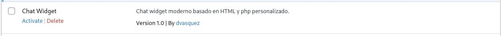
