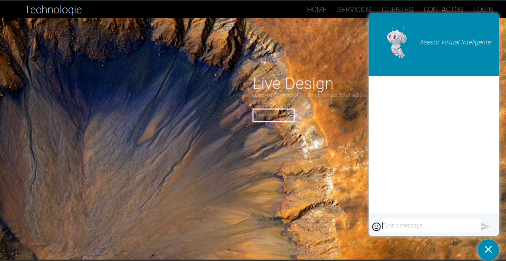
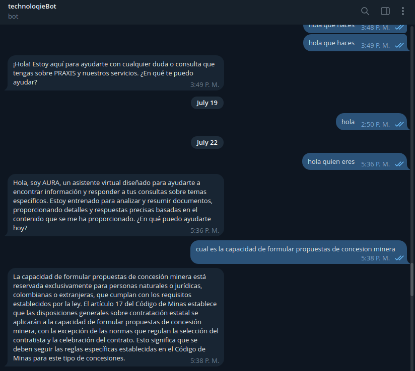
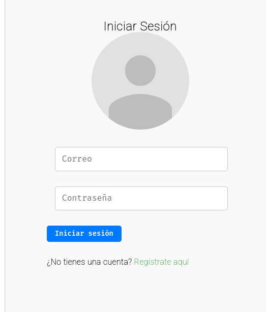
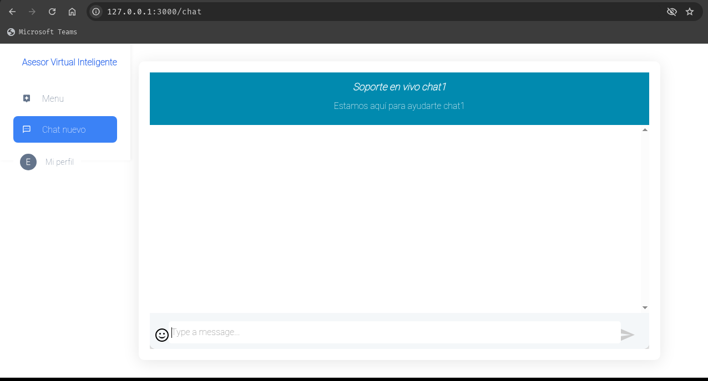
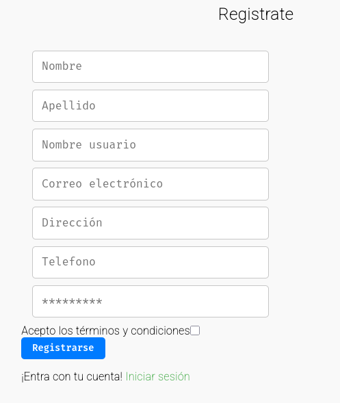
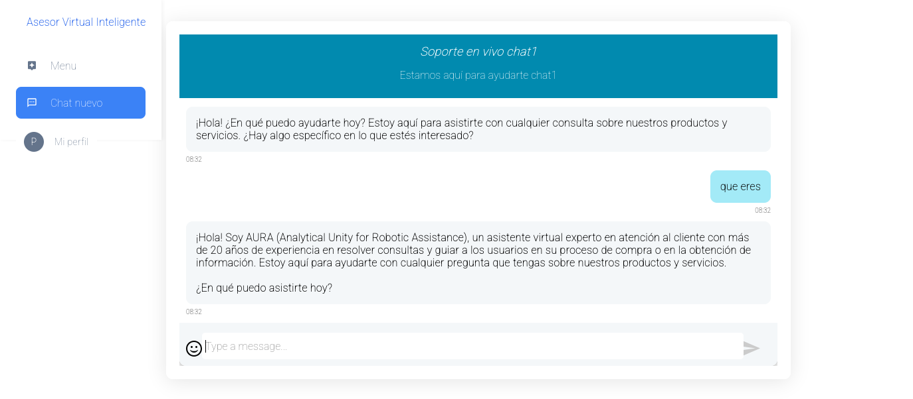
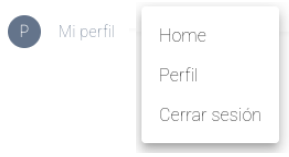

# Manual de Usuario - Sistema Smart de Chatbot

## Documento de Visión y Alcance

### Propósito del Sistema

El **Sistema Smart de Chatbot** es una plataforma conversacional basada en inteligencia artificial diseñada para transformar la manera en que las organizaciones interactúan con sus clientes. Este sistema utiliza redes neuronales avanzadas para el entrenamiento de modelos preentrenados, combinado con robustas medidas de ciberseguridad, para ofrecer respuestas contextualmente relevantes mientras garantiza la protección de datos sensibles.

### Arquitectura Técnica

El sistema está construido sobre una arquitectura moderna y escalable:

- **Motor de IA**: Implementado en python para procesamiento de lenguaje natural
- **Microservicio de Mensajería**: Desarrollado en Java con Spring Boot
- **Contenerización**: Cada componente ejecutado en contenedores Docker
- **Accesibilidad**: Interfaz web accesible desde cualquier navegador con conexión a Internet
- **Dispositivos Móviles**: Aplicación compatible con smartphones y tablets

### Ventajas Competitivas

Un chatbot representa una ventaja estratégica para cualquier organización, independientemente de su sector o etapa de desarrollo:

- **Personalización**: Experiencias adaptadas a cada usuario
- **Autoservicio**: Reduce la carga en equipos de soporte
- **Disponibilidad 24/7**: Atención inmediata sin tiempos de espera
- **Costos Reducidos**: Optimiza recursos de atención al cliente
- **Minería de Textos**: Descubre información implícita y útil en conversaciones

---

## Capítulo I: Guía de Usuario

### 1. Introducción

Bienvenido al Sistema Smart de Chatbot. Este manual le guiará a través de todas las funcionalidades disponibles para usuarios registrados, desde el inicio de sesión hasta el cierre de sesión.

### 2. Objetivos del Proyecto

El sistema busca proporcionar:

- Un canal de conversación sensible y receptivo
- Respuestas automáticas a preguntas frecuentes
- Simulación de conversación humana natural
- Gestión eficiente de la atención al cliente
- Acceso desde múltiples plataformas (web y móvil)

### 3. Requisitos de Funcionalidad

#### Requisitos Técnicos

- Navegador web moderno (Chrome, Firefox, Safari, Edge)
- Conexión a Internet estable
- Dispositivo compatible: computadora, smartphone o tablet

#### Requisitos de Acceso

- Cuenta de usuario registrada en el sistema
- Credenciales válidas (usuario y contraseña)
- Acceso autorizado al sistema

### 4. Canales de Interacción

El sistema Smart de Chatbot ha sido diseñado bajo un modelo de arquitectura modular que contempla dos modalidades de interacción diferenciadas, con el objetivo de equilibrar accesibilidad, seguridad y funcionalidad avanzada.

#### 4.1 Chat Público de Acceso Abierto

El chatbot puede ser fácilmente incrustado como un widget en cualquier página web corporativa, landing page o sistema CMS mediante un script embebido o ser accedido a través de redes sociales como Facebook, Instagram, Whatsapp, Telegram, ofreciendo asistencia en tiempo real sin necesidad de autenticación. Este acceso está diseñado para usuarios que buscan información general sobre servicios, productos, preguntas frecuentes o bolsa de empleo sin necesidad de autenticación previa.

#### 4.2 Chat Público en Telegram

Para usuarios de Telegram, el chatbot ofrece un canal de comunicación directo para obtener respuestas rápidas y asistencia.

### 5. Inicio de Sesión
#### 5.1 Ingresar al Sistema

Para acceder al chatbot, siga estos pasos:

1. Abra su navegador web
2. Navegue a la URL del sistema proporcionada por su administrador
3. En la pantalla de inicio de sesión, ingrese:
   - **Usuario**: Su nombre de usuario registrado
   - **Contraseña**: Su contraseña segura
4. Haga clic en el botón  **"Iniciar Sesión"**
5. Será redirigido al panel principal del chatbot
**Nota de Seguridad**: Asegúrese de que la conexión sea segura (HTTPS) antes de ingresar sus credenciales.

### 6. Aplicación para Usuario Registrado

#### 6.1 Ingreso de Usuario

Una vez autenticado, tendrá acceso a:

- **Panel de Chat**: Interfaz principal de conversación
- **Historial de Conversaciones**: Acceso a chats anteriores
- **Configuración de Perfil**: Gestión de información personal
- **Preferencias**: Ajustes de notificaciones y temas

#### 6.2 Registro de Usuario

Si aún no tiene una cuenta:

1. En la pantalla de inicio de sesión, haga clic en **"Registrarse"**
2. Complete el formulario con:
   - Nombre completo
   - Correo electrónico válido
   - Nombre de usuario deseado
   - Contraseña segura (mínimo 8 caracteres)
3. Acepte los términos y condiciones
4. Haga clic en **"Crear Cuenta"**
5. Verifique su correo electrónico si es requerido

#### 6.3 Iniciar Chat Nuevo

Para comenzar una nueva conversación:

1. Desde el panel principal, haga clic en **"Nuevo Chat"**
2. Escriba su mensaje en el campo de texto
3. Presione Enter o haga clic en el botón de enviar
4. El chatbot responderá automáticamente basándose en su consulta

**Consejo**: Sea específico en sus preguntas para obtener mejores respuestas.

#### 6.4 Cerrar Sesión

Para cerrar sesión de manera segura:

1. Haga clic en su nombre de usuario en la esquina superior derecha
2. Seleccione **"Cerrar Sesión"** del menú desplegable
3. Confirme la acción si se solicita
4. Será redirigido a la página de inicio de sesión

**Importante**: Siempre cierre sesión al terminar, especialmente en dispositivos compartidos.

### 7. Tipos de Perfil

El sistema soporta diferentes niveles de acceso:

| Tipo de Usuario | Descripción |
| --------------- | ------------ |
| admin | Todas las funciones de usuario estándar. Gestión de usuarios. Configuración del sistema. Reportes y análisis de conversaciones.| 
| user | Acceso al chatbot. Historial de conversaciones personales. Configuración de perfil básica | 

---

## Consideraciones de Seguridad

### Protección de Datos

- Todas las comunicaciones están encriptadas (SSL/TLS)
- Las contraseñas se almacenan de forma segura (hash + salt)
- Se implementan medidas contra ataques de fuerza bruta
- Auditoría de todas las acciones críticas

### Mejores Prácticas

1. **Contraseñas**: Use contraseñas fuertes y únicas
2. **Sesiones**: No comparta su cuenta con otros usuarios
3. **Dispositivos**: Cierre sesión en dispositivos públicos
4. **Actualizaciones**: Mantenga su navegador actualizado
5. **Phishing**: Verifique siempre la URL antes de iniciar sesión

---

## Soporte y Contacto

Si experimenta algún problema o tiene preguntas:

- Consulte la sección de preguntas frecuentes (FAQ)
- Contacte al soporte técnico a través de los canales oficiales
- Reporte errores o sugerencias para mejorar el sistema

---

**Versión del Documento**: 1.0  
**Fecha de Actualización**: Enero 2026  
**Autor**: technoloqie
