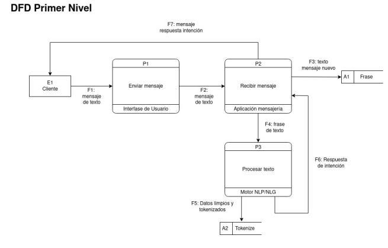

# Documentación de Diagramas de Flujo de Datos (DFD) - Sistema Smart de Chatbot

## Introducción

Los Diagramas de Flujo de Datos (DFD) representan el flujo de información dentro del Sistema Smart de Chatbot, mostrando cómo los datos son procesados, almacenados y transformados entre los diferentes componentes del sistema. Esta documentación detalla la arquitectura de flujo de datos del nivel 0 (contexto) del sistema.

## DFD Nivel 1 - Diagrama de Contexto

### Descripción General
El Diagrama de Contexto (Nivel 1 DFD) proporciona una visión general de alto nivel del Sistema Smart de Chatbot, mostrando las interacciones entre el sistema y las entidades externas con las que se comunica.

### Componentes del DFD Nivel 1

#### Entidades Externas
1. **Usuario Final** - Interactúa con el sistema a través de la interfaz web del chatbot
2. **Administrador del Sistema** - Gestiona y configura el sistema a través del panel administrativo
3. **Sistemas Externos** - Fuentes de datos externas como ERP, CMS, y bases de datos empresariales

#### Procesos Principales
1. **Procesamiento de Consultas del Usuario** - Maneja las interacciones conversacionales
2. **Gestión de Conocimiento** - Administra la base de conocimiento del chatbot
3. **Análisis y Reportes** - Genera métricas y análisis de las interacciones

#### Almacenes de Datos
1. **Base de Conocimiento del Chatbot** - Almacena los patrones conversacionales y respuestas
2. **Registro de Interacciones** - Guarda el historial de conversaciones
3. **Datos de Configuración** - Configuraciones del sistema y preferencias de usuario

### Flujos de Datos Principales

#### Entrada
- Consultas y preguntas de usuarios
- Datos de configuración del administrador
- Fuentes de conocimiento externas

#### Salida
- Respuestas automatizadas del chatbot
- Reportes de análisis y métricas
- Actualizaciones de la base de conocimiento

## DFD Nivel 2 - Descomposición Funcional

### Proceso 1: Gestión de Conversaciones
**Descripción:** Procesa las interacciones en tiempo real con los usuarios finales

**Subprocesos:**
- Recepción de mensajes
- Análisis de intención del usuario
- Generación de respuestas contextuales
- Gestión del estado de la conversación

### Proceso 2: Administración del Conocimiento
**Descripción:** Gestiona y actualiza la base de conocimiento del chatbot

**Subprocesos:**
- Carga de datos desde fuentes externas
- Procesamiento ETL de información
- Entrenamiento de modelos de IA
- Validación de respuestas

### Proceso 3: Generación de Reportes
**Descripción:** Produce análisis y métricas del desempeño del sistema

**Subprocesos:**
- Recolección de datos de interacción
- Cálculo de KPIs de desempeño
- Generación de dashboards
- Exportación de reportes

## Especificaciones Técnicas

### Estándares de Modelado
- **Notación:** Yourdon/DeMarco
- **Herramienta:** Microsoft Visio / draw.io
- **Versión:** 1.0

### Convenciones de Nomenclatura
- **Procesos:** P1, P2, P3...
- **Almacenes:** D1, D2, D3...
- **Entidades:** E1, E2, E3...
- **Flujos:** Descripción verbal del dato

### Reglas de Validación
1. Todos los procesos deben tener al menos una entrada y una salida
2. Los almacenes deben ser accedidos solo a través de procesos
3. Las entidades externas no pueden comunicarse directamente entre sí

## Consideraciones de Arquitectura

### Escalabilidad
Los DFD han sido diseñados considerando:
- Crecimiento horizontal mediante microservicios
- Separación de concerns entre procesamiento y almacenamiento
- Capacidad de distribuir carga entre diferentes instancias

### Seguridad
- Autenticación requerida para acceso administrativo
- Validación de entrada en todos los flujos de datos
- Encriptación de datos sensibles en tránsito y en reposo

### Mantenibilidad
- Documentación completa de todos los flujos
- Versionado de diagramas
- Capacidad de trazar datos a través del sistema

## Relación con Otros Diagramas

Este DFD se relaciona con:
- **Diagrama de Despliegue:** Muestra la implementación física
- **Diagrama de Secuencia:** Detalla las interacciones temporales
- **Diagrama de Clases:** Define la estructura estática del sistema

## Notas de Implementación

### Tecnologías Utilizadas
- **Backend:** Java Spring Boot para procesamiento de mensajes
- **IA/NLP:** Python con frameworks de machine learning
- **Almacenamiento:** MySQL y MongoDB
- **Frontend:** React.js para interfaz de usuario

### Consideraciones de Performance
- Latencia objetivo: < 2 segundos para respuestas
- Throughput: Soporte para 1000+ conversaciones concurrentes
- Disponibilidad: 99.9% uptime

## Versión y Control de Cambios

| Versión | Fecha | Descripción | Autor |
|---------|-------|-------------|-------|
| 1.0 | 2026-03-03 | Documentación inicial del DFD Nivel 0 | Sistema |

## Referencias

- IEEE Standard 1016-2009 - Recommended Practice for Software Design Descriptions
- Yourdon/DeMarco DFD Notation Standards
- Documentación del Sistema Smart de Chatbot

---

*Nota: Esta documentación requiere la integración con los diagramas visuales correspondientes para completar el análisis. Los componentes específicos deben ser verificados contra el diagrama DFD visual en `assets/img/dfd-level0.png`.*