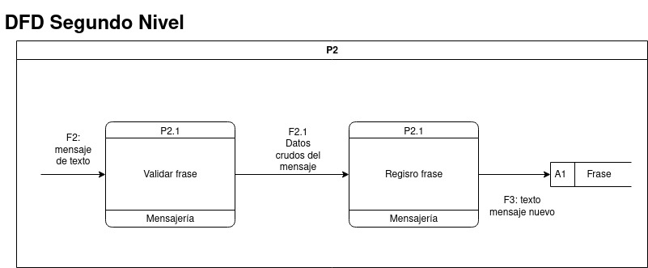
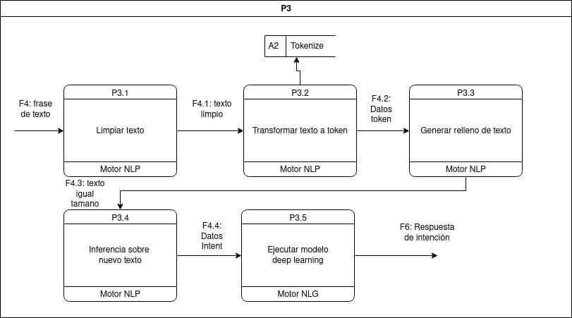
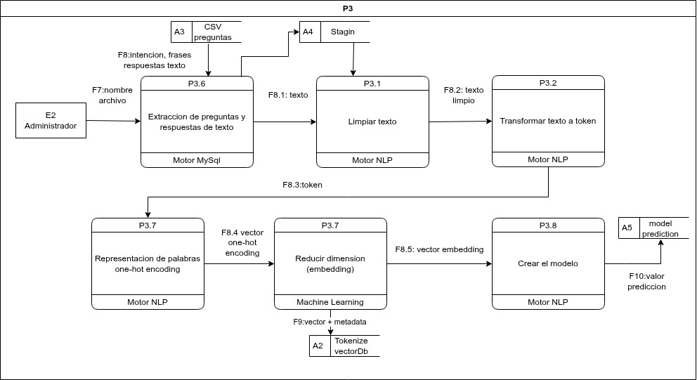
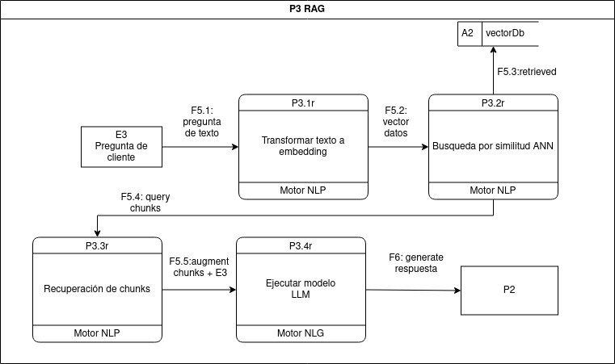
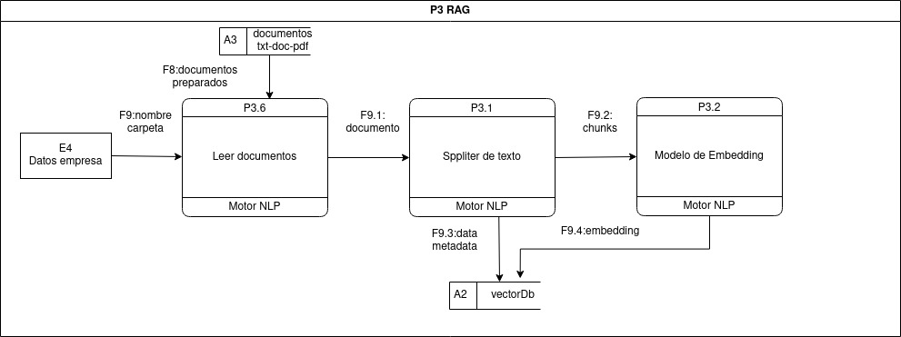
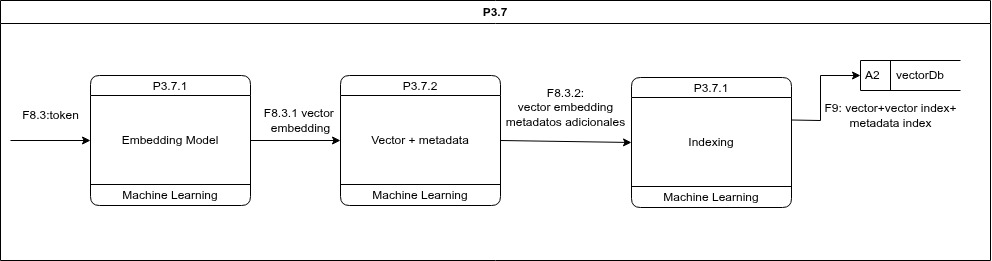

# Documentación de Diagramas de Flujo de Datos (DFD) - Sistema Smart de Chatbot

## Introducción

Este documento describe los Diagramas de Flujo de Datos (DFD) para el **Sistema Smart de Chatbot** de mensajería automatizada con procesamiento de lenguaje natural. El DFD proporciona una visión clara de cómo los datos fluyen a través del sistema, desde el momento en que el cliente envía un mensaje hasta que recibe una respuesta generada por el motor de procesamiento de lenguaje natural (NLP).

El objetivo es proporcionar un manual técnico detallado para desarrolladores e ingenieros de software, facilitando la comprensión del flujo de datos, la integración de módulos y la implementación de modelos NLP y LLM.

## **1. DFD Primer Nivel**

### **1.1 Descripción General**

El DFD de primer nivel muestra cómo los mensajes enviados por el cliente son recibidos, procesados y respondidos mediante el motor NLP/NLG.

**Entidades Externas:**

- **E1: Cliente** – Envia y recibe mensajes de texto.

**Procesos:**

- **P1: Enviar mensaje** – Captura el mensaje del cliente.
- **P2: Recibir mensaje** – Gestiona la recepción y validación del mensaje.
- **P3: Procesar texto** – Analiza y procesa el mensaje para inferir la intención.

**Almacenes de Datos:**

- **A1: Frase** – Mensajes recibidos antes de procesarse.
- **A2: Tokenize** – Datos tokenizados y preparados para análisis.

**Flujos de Datos:**

| ID | Flujo | Descripción |
|----|-------|-------------|
| F1 | Mensaje de texto | Mensaje enviado por el cliente. |
| F2 | Mensaje de texto | Transmisión del mensaje al sistema. |
| F3 | Texto mensaje nuevo | Texto listo para procesamiento. |
| F4 | Frase de texto | Mensaje limpio para tokenización. |
| F5 | Datos limpios y tokenizados | Tokens generados por NLP. |
| F6 | Respuesta de intención | Respuesta inferida del modelo NLP. |
| F7 | Mensaje respuesta intención | Respuesta enviada al cliente. |

---

### **1.2 Diccionario de Datos – Primer Nivel**

| Elemento | Descripción | Tipo | Proceso Asociado |
|----------|-------------|------|-----------------|
| F1 | Mensaje del cliente | String | P1 |
| F2 | Mensaje de texto al sistema | String | P2 |
| F3 | Texto mensaje nuevo | String | P2 |
| F4 | Frase de texto | String | P3 |
| F5 | Datos tokenizados | Array | P3 |
| F6 | Respuesta de intención | String | P3 |
| F7 | Mensaje respuesta intención | String | P3 |
| A1 | Frase | String | P2 |
| A2 | Tokenize | Array | P3 |

## **2. DFD Segundo Nivel – P2: Recibir Mensaje**

### **2.1 Descripción General**

El proceso **P2: Recibir mensaje** se encarga de validar y registrar los mensajes enviados por el cliente.

**Subprocesos:**

- **P2.1: Validar frase** – Verifica la estructura y contenido del mensaje.
- **P2.2: Registro frase** – Almacena el mensaje validado en A1.

**Flujos de Datos:**

| ID | Flujo | Descripción |
|----|-------|-------------|
| F2 | Mensaje de texto | Mensaje recibido del cliente. |
| F2.1 | Datos crudos del mensaje | Mensaje validado listo para registro. |
| F3 | Texto mensaje nuevo | Mensaje almacenado en A1. |

**Almacén de Datos:**

- **A1: Frase** – Contiene mensajes validados para su posterior procesamiento.

## **3. DFD Segundo Nivel – P3: Procesar Texto**

### **3.1 Descripción General**

El proceso **P3: Procesar texto** utiliza un motor NLP para interpretar mensajes, tokenizar, generar embeddings y ejecutar un modelo deep learning para inferir la intención.

**Subprocesos:**

| ID | Subproceso | Descripción |
|----|------------|-------------|
| P3.1 | Limpiar texto | Depuración y normalización de mensajes. |
| P3.2 | Transformar texto a token | Tokenización del mensaje. |
| P3.3 | Generar relleno de texto | Ajuste de tamaño y consistencia. |
| P3.4 | Inferencia sobre nuevo texto | Clasificación de la intención. |
| P3.5 | Ejecutar modelo deep learning | Generación de respuesta final. |

**Flujos de Datos:**

| ID | Flujo | Descripción |
|----|-------|-------------|
| F4 | Frase de texto | Entrada de P3 |
| F4.1 | Texto limpio | Salida P3.1 |
| F4.2 | Datos token | Salida P3.2 |
| F4.3 | Texto igual tamaño | Salida P3.3 |
| F4.4 | Datos intent | Salida P3.4 |
| F6 | Respuesta de intención | Salida P3.5 |

**Almacén de Datos:**

- **A2: Tokenize** – Datos tokenizados listos para análisis.

## **4. DFD Segundo Nivel – P3 (Rol Administrador)**

### **4.1 Descripción General**

El administrador puede cargar datos de entrenamiento, generar embeddings y entrenar modelos de NLP.

**Subprocesos:**

| ID | Subproceso | Descripción |
|----|------------|-------------|
| P3.1 | Limpiar texto | Normalización de datos administrativos. |
| P3.2 | Transformar texto a token | Tokenización para entrenamiento. |
| P3.3 | Tokenización | Preparación de tokens. |
| P3.4 | Vectorización | One-hot encoding de palabras. |
| P3.5 | Reducción de dimensiones | Creación de embeddings. |
| P3.6 | Extracción de preguntas y respuestas | Lectura de CSV o DB MySQL. |
| P3.7 | Creación del modelo | Entrenamiento ML/NLP. |
| P3.8 | Predicción | Predicción de intenciones. |

**Almacén de Datos:**

- **A2: Tokenize/vectorDb** – Vectores tokenizados y embeddings.

## **5. DFD Segundo Nivel – P3 RAG1**

### **5.1 Descripción General**

Proceso RAG (Retrieval-Augmented Generation) para preguntas de clientes:

**Subprocesos:**

| ID | Subproceso | Descripción |
|----|------------|-------------|
| P3.1r | Transformar texto a embedding | Pregunta del cliente a vector. |
| P3.2r | Búsqueda por similitud ANN | Recuperación de vectores similares. |
| P3.3r | Recuperación de chunks | Fragmentos relevantes del vectorDb. |
| P3.4r | Ejecutar modelo LLM | Generación de respuesta usando LLM. |

**Flujos de Datos:**

| ID | Flujo | Descripción |
|----|-------|-------------|
| F5.1 | Pregunta de texto | Entrada del cliente. |
| F5.2 | Vector datos | Embedding de la pregunta. |
| F5.3 | Retrieved | Chunks relevantes recuperados. |
| F5.4 | Query chunks | Fragmentos adicionales de la consulta. |
| F5.5 | Augment chunks + E3 | Chunks combinados con pregunta. |
| F6 | Generate respuesta | Respuesta generada por LLM. |

**Almacén de Datos:**

- **A2: vectorDb** – Almacena vectores recuperados.

## **6. DFD Segundo Nivel – P3 RAG2: Carga de Documentos**

**Subprocesos:**

| ID | Subproceso | Descripción |
|----|------------|-------------|
| P3.6 | Leer documentos | Lectura de documentos (txt, doc, pdf). |
| P3.1 | Splitter de texto | División de documentos en chunks. |
| P3.2 | Modelo de Embedding | Transformación de chunks en vectores. |

**Flujos de Datos:**

| ID | Flujo | Descripción |
|----|-------|-------------|
| F8 | Documentos preparados | Archivos txt/doc/pdf de la empresa. |
| F9 | Nombre carpeta | Carpeta de documentos. |
| F9.1 | Documento | Documento convertido a texto. |
| F9.2 | Chunks | Fragmentos de texto. |
| F9.3 | Data metadata | Metadatos de los chunks. |
| F9.4 | Embedding | Vectores de chunks para vectorDb. |

**Almacén de Datos:**

- **A2: vectorDb** – Vectores de documentos y metadatos.

## **7. DFD Tercer Nivel – P3.7 Embedding Model**

**Subprocesos:**

| ID | Subproceso | Descripción |
|----|------------|-------------|
| P3.7.1 | Generación de embeddings | Transformación de tokens a vectores. |
| P3.7.2 | Añadir metadatos | Enriquecimiento de vectores con información adicional. |
| P3.7.3 | Indexación | Almacenamiento en vectorDb para búsquedas. |

**Almacén de Datos:**

- **A2: vectorDb** – Almacena vectores con metadatos e índices para consulta eficiente.

## **8. Conclusión**

El sistema combina **procesamiento de texto, NLP/NLG, embeddings y RAG**, permitiendo:

- Recepción y validación de mensajes de clientes.
- Procesamiento y tokenización para inferencia de intenciones.
- Entrenamiento y administración de modelos de NLP por administradores.
- Recuperación de datos y generación de respuestas precisas mediante embeddings y LLM.
- Carga y preparación de documentos corporativos para consulta semántica.

Esta documentación proporciona una visión integral del flujo de datos, almacenes y subprocesos necesarios para la implementación y mantenimiento del sistema.